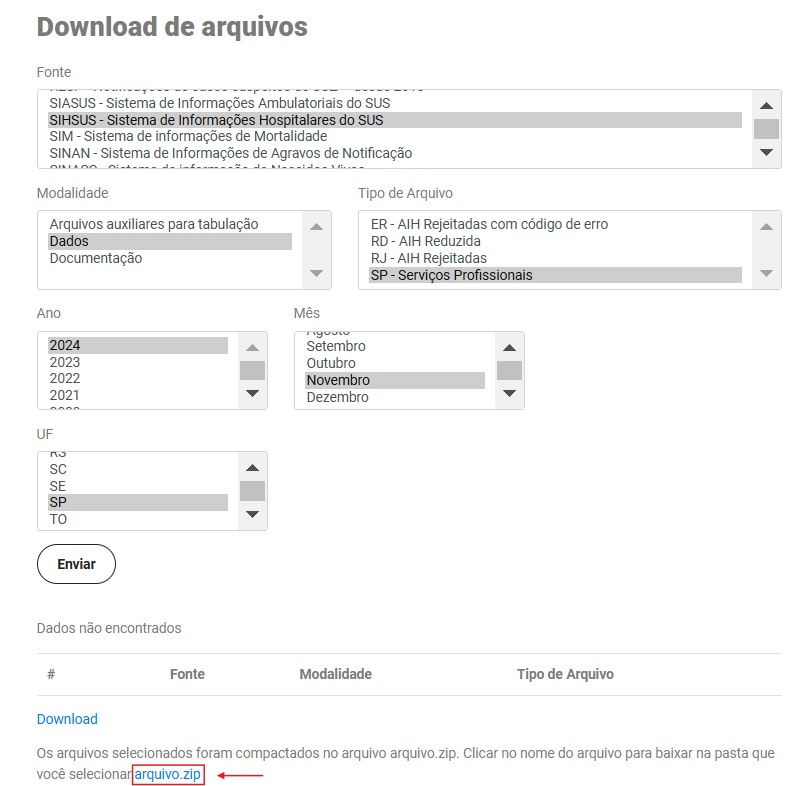

# 🏥 Projeto de Engenharia de Dados na Saúde no Brasil

Desenvolvimento de uma pipeline de dados para ingestão e transformação de grandes volumes de dados de internações hospitalares (AIH - Autorização de Internação Hospitalar) do DATASUS.

## 🛠️ Componentes e Ferramentas:
- **AWS S3:** Armazenamento em camadas (Bronze, Silver e Gold).
- **Apache Spark:** Processamento distribuído de dados.
- **Airflow:** Orquestração das tarefas da pipeline.
- **Docker:** Criação de containers para padronizar ambientes.
- **SQL:** Para consultas e agregações durante a transformação.

## Url Download

https://datasus.saude.gov.br/transferencia-de-arquivos/#

## Escopo Inicial para AIH

**1. Definir o Período de Análise:**

- Intervalo de 3 a 5 anos (2018 a 2023).
- Dados limitados pelo estado de São Paulo para reduzir o volume inicial.

**2. Variáveis de Interesse:**

- Diagnóstico principal (CID).
- Procedimentos realizados.
- Duração da internação.
- Custos da internação.
- Tipo de hospital (público ou privado).

**3. Objetivos Analíticos Focados:**

- Identificar os diagnósticos mais frequentes por tipo de hospital e região.
- Analisar os custos médios por tipo de internação.
- Avaliar a evolução do tempo médio de internação para doenças crônicas.

**4. Dados Complementares (Opcional):**

- Tabelas de referências do DATASUS, como códigos CID e procedimentos.

## Primeiras Etapas

**Ingestão:**

- Baixar os dados da AIH do DATASUS (formato CSV ou DBF).
  - (https://datasus.saude.gov.br/transferencia-de-arquivos/#)
- Ingestão inicial para AWS S3 (camada Bronze).

**Processamento:**

- Padronizar e limpar os dados no Apache Spark.
- Estruturar tabelas analíticas para facilitar consultas.

**Resultados Simples:**

- Criar uma tabela básica com os diagnósticos mais frequentes e custos associados.

## Fase 1: Planejamento da Pipeline de Dados

### Etapas

**1. Estrutura da Pipeline:**

- Camada de Ingestão:
  - Baixar os dados de AIH do DATASUS para a camada "Bronze" do AWS S3.
- Camada de Processamento:
  - Limpar, padronizar e transformar os dados utilizando Apache Spark.
- Camada de Análise:
  - Criar tabelas analíticas (camada "Gold") prontas para consumo por ferramentas de visualização e análises.

**2. Componentes e Ferramentas:**

- AWS S3: Armazenamento em camadas (Bronze, Silver e Gold).
- Apache Spark: Processamento distribuído de dados.
- Airflow: Orquestração das tarefas da pipeline.
- Docker: Criação de containers para padronizar ambientes.
- SQL: Para consultas e agregações durante a transformação.

**3. Variáveis Inicialmente Selecionadas:**

- Diagnósticos (CID principal e secundário).
- Tempo de internação.
- Custo total da internação.
- Tipo de hospital (público ou privado).
- Data de admissão e alta.

## Fase 2: Elaboração de Scripts Iniciais

**1. Script para Ingestão de Dados:**

- O script buscará arquivos CSV disponíveis no DATASUS e os carregará para a camada Bronze do AWS S3.
- Código Python para Ingestão: [scripts/ingestion.py](scripts/ingestion.py)

**2. Script para Transformação (Camada Silver):**

- Após a ingestão, o próximo passo será usar o Apache Spark para limpar e padronizar os dados.
- Tarefa Inicial com Spark
- Objetivo: Filtrar colunas principais, remover registros inválidos e salvar como Parquet.
- Código Python para Transformação: [scripts/transformation.py](scripts/transformation.py)

## Especificação Técnica

- **IDE:** VSCode (Visual Studio Code)
- **Linguagem:** Python
  - **Bibliotecas (principais):** boto3, pyspark

## Configuração e Execução

### 1. Criar o Ambiente Virtual

- **1.1. Abra o terminal ou o PowerShell no Windows.**

- **1.2. Navegue até o diretório base do projeto:**
  cd D:\GitHub\ds-aih-pipeline

- **1.3. Crie o ambiente virtual:**
  python -m venv venv

- **1.4. Ative o ambiente virtual:**
  venv\Scripts\activate

### 2. Instalar as Dependências

- **2.1. Instale as dependências do arquivo requirements.txt existente**
  pip install -r requirements.txt

- **2.2. OU CASO exclua o arquivo requirements.txt existente:**

  - **2.2.1. Primeiro: Instale as dependências necessárias com pip:**
    pip install pyspark
    pip install boto3

  - **2.2.2. Segundo: Gere arquivo requirements.txt**
    pip freeze > requirements.txt

### 3. Executar o Script

- **3.1. Navegue até o diretório onde está o script:**
  cd D:\GitHub\ds-aih-pipeline\scripts

- **3.2. Execute o script de ingestion com o Python:**
  python ingestion.py

### 4. Manutenção do Ambiente

- **4.1. Para Desativar o Ambiente:**
  **Quando terminar de usar o ambiente virtual, você pode desativá-lo com o comando:**
  deactivate

- **4.2. Para Reativar o Ambiente:**
  **Sempre que quiser executar novamente, reative o ambiente com:**
  venv\Scripts\activate
